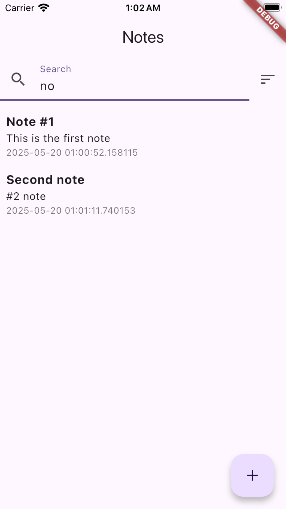

# note_app

Notes App - A simple notes app built with Flutter and Dart.

## Screenshots

## Как запустить проект

1. `dart pub get`
2. `dart run build_runner build --delete-conflicting-outputs`
3. `flutter run`

## Какие архитектурные подходы использовались

- Clean Architecture
- Bloc
- Repository Pattern
- Dependency Injection
- Data Layer
- Presentation Layer
- Model Layer

## Доп. фичи

☑️ Темная тема

✅ Поиск по заметкам

✅ Сортировка по дате

☑️ Поддержка Flutter Web или Desktop

☑️ Мини-тесты: 1-2 unit/widget теста